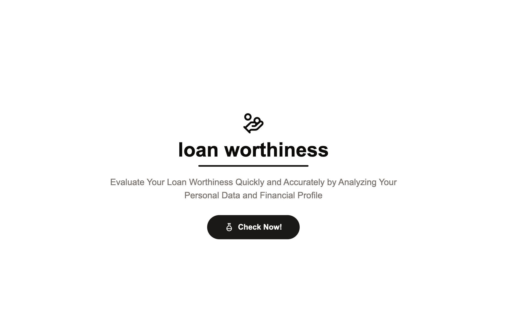

# Loan Worthiness Frontend



## 🏦 Project Overview

A modern web application for loan eligibility prediction using Next.js, Tailwind CSS, and Shadcn/UI. This frontend interfaces with the backend to provide an intuitive loan assessment experience.

## 🔗 Project Links

- **Frontend Live Demo:** [https://kelayakanpinjaman.vercel.app/](https://kelayakanpinjaman.vercel.app/)
- **Backend Repository:** [https://github.com/gdapriana/kelayakan-pinjaman-backend](https://github.com/gdapriana/kelayakan-pinjaman-backend)
- **Backend API:** [https://kelayakan-pinjaman-backend.vercel.app](https://kelayakan-pinjaman-backend.vercel.app)

## 🚀 Technologies Used

- **Framework:** Next.js
- **Styling:** Tailwind CSS
- **Component Library:** Shadcn/UI
- **Deployment:** Vercel

## 📦 Features

- Loan eligibility prediction
- Intuitive user interface
- Responsive design
- Real-time backend integration

## 🛠️ Getting Started

### Prerequisites

- Node.js (version 18 or later)
- npm or yarn

### Installation

1. Clone the repository

```bash
git clone https://github.com/your-username/kelayakan-pinjaman-frontend.git
```

2. Install dependencies

```bash
cd kelayakan-pinjaman-frontend
npm install
# or
yarn install
```

3. Create a `.env.local` file with the following variable:

```
NEXT_PUBLIC_SERVER=https://kelayakan-pinjaman-backend.vercel.app
```

4. Run the development server

```bash
npm run dev
# or
yarn dev
```

## 📂 Project Structure

```
kelayakan-pinjaman-frontend/
│
├── components/           # Reusable UI components
│   └── ui/               # Shadcn/UI components
├── app/                  # Next.js app directory
│   ├── page.tsx          # Main page component
│   └── layout.tsx        # Global layout
├── lib/                  # Utility functions
├── styles/               # Global CSS
└── public/               # Static assets
```

## 🤝 Contributing

1. Fork the repository
2. Create your feature branch (`git checkout -b feature/AmazingFeature`)
3. Commit your changes (`git commit -m 'Add some AmazingFeature'`)
4. Push to the branch (`git push origin feature/AmazingFeature`)
5. Open a Pull Request